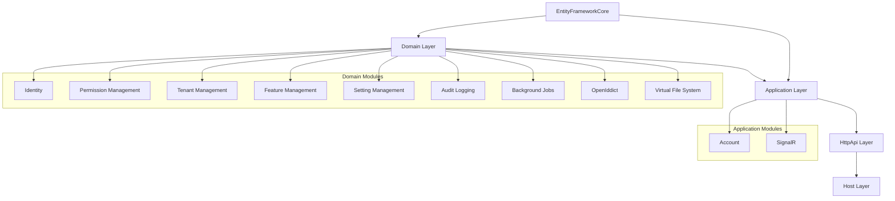

# 🚀 ABP.IO Modules Implementation Summary

## ✅ Módulos ABP.IO Implementados (Gratuitos)

### 📋 Módulos Configurados no Projeto

#### **1. Identity Module** ✅
**Gerenciamento de Identidade e Usuários**

**Funcionalidades:**
- ✅ **User Management** - CRUD de usuários
- ✅ **Role Management** - Gestão de papéis e permissões
- ✅ **Organization Units** - Estrutura organizacional
- ✅ **Claims Management** - Claims personalizados
- ✅ **Password Policies** - Políticas de senha
- ✅ **Two-Factor Authentication** - Autenticação 2FA

**Pacotes Instalados:**
```xml
<PackageReference Include="Volo.Abp.Identity.Domain" Version="10.2.0" />
<PackageReference Include="Volo.Abp.Identity.Application" Version="10.2.0" />
<PackageReference Include="Volo.Abp.Identity.EntityFrameworkCore" Version="10.2.0" />
```

---

#### **2. Permission Management Module** ✅
**Sistema de Gerenciamento de Permissões**

**Funcionalidades:**
- ✅ **Permission Definitions** - Definição de permissões
- ✅ **Permission Storage** - Armazenamento de permissões
- ✅ **Permission Checking** - Verificação em runtime
- ✅ **Dynamic Permissions** - Permissões dinâmicas
- ✅ **Permission Providers** - Provedores extensíveis

**Pacotes Instalados:**
```xml
<PackageReference Include="Volo.Abp.PermissionManagement.Domain.Identity" Version="10.2.0" />
<PackageReference Include="Volo.Abp.PermissionManagement.Domain.OpenIddict" Version="10.2.0" />
<PackageReference Include="Volo.Abp.PermissionManagement.Application" Version="10.2.0" />
<PackageReference Include="Volo.Abp.PermissionManagement.EntityFrameworkCore" Version="10.2.0" />
```

---

#### **3. Tenant Management Module** ✅
**Multi-tenancy para SaaS**

**Funcionalidades:**
- ✅ **Tenant CRUD** - Gestão de tenants
- ✅ **Tenant Connection** - Conexões por tenant
- ✅ **Tenant Features** - Features por tenant
- ✅ **Tenant Settings** - Configurações por tenant
- ✅ **Data Isolation** - Isolamento de dados

**Pacotes Instalados:**
```xml
<PackageReference Include="Volo.Abp.TenantManagement.Domain" Version="10.2.0" />
<PackageReference Include="Volo.Abp.TenantManagement.Application" Version="10.2.0" />
<PackageReference Include="Volo.Abp.TenantManagement.EntityFrameworkCore" Version="10.2.0" />
```

---

#### **4. Feature Management Module** ✅
**Sistema de Feature Toggle**

**Funcionalidades:**
- ✅ **Feature Definitions** - Definição de features
- ✅ **Feature Values** - Valores por tenant/global
- ✅ **Feature Checking** - Verificação de features
- ✅ **Feature Providers** - Provedores hierárquicos
- ✅ **Runtime Control** - Controle em tempo de execução

**Pacotes Instalados:**
```xml
<PackageReference Include="Volo.Abp.FeatureManagement.Domain" Version="10.2.0" />
<PackageReference Include="Volo.Abp.FeatureManagement.Application" Version="10.2.0" />
<PackageReference Include="Volo.Abp.FeatureManagement.EntityFrameworkCore" Version="10.2.0" />
```

---

#### **5. Setting Management Module** ✅
**Sistema de Configurações**

**Funcionalidades:**
- ✅ **Setting Definitions** - Definição de configurações
- ✅ **Setting Values** - Valores hierárquicos
- ✅ **Setting Providers** - Provedores de configuração
- ✅ **Email Settings** - Configurações de email
- ✅ **Global/Tenant/User Settings** - Escopo de configurações

**Pacotes Instalados:**
```xml
<PackageReference Include="Volo.Abp.SettingManagement.Domain" Version="10.2.0" />
<PackageReference Include="Volo.Abp.SettingManagement.Application" Version="10.2.0" />
<PackageReference Include="Volo.Abp.SettingManagement.EntityFrameworkCore" Version="10.2.0" />
```

---

#### **6. Audit Logging Module** ✅
**Sistema de Auditoria e Logging**

**Funcionalidades:**
- ✅ **Entity Change Tracking** - Mudanças de entidades
- ✅ **Method Execution Logging** - Logs de métodos
- ✅ **User Context** - Contexto do usuário
- ✅ **Exception Logging** - Logs de exceções
- ✅ **Property Changes** - Mudanças de propriedades

**Pacotes Instalados:**
```xml
<PackageReference Include="Volo.Abp.AuditLogging.Domain" Version="10.2.0" />
<PackageReference Include="Volo.Abp.AuditLogging.EntityFrameworkCore" Version="10.2.0" />
```

---

#### **7. Background Jobs Module** ✅
**Sistema de Jobs em Background**

**Funcionalidades:**
- ✅ **Job Storage** - Armazenamento de jobs
- ✅ **Job Execution** - Execução de jobs
- ✅ **Job Retries** - Retentativas automáticas
- ✅ **Job Priority** - Priorização de jobs
- ✅ **Job Monitoring** - Monitoramento de jobs

**Pacotes Instalados:**
```xml
<PackageReference Include="Volo.Abp.BackgroundJobs.Domain" Version="10.2.0" />
<PackageReference Include="Volo.Abp.BackgroundJobs.EntityFrameworkCore" Version="10.2.0" />
```

---

#### **8. OpenIddict Module** ✅
**OAuth 2.0 e OpenID Connect**

**Funcionalidades:**
- ✅ **Authorization Server** - Servidor de autorização
- ✅ **Token Management** - Gestão de tokens
- ✅ **Client Management** - Gestão de clientes OAuth
- ✅ **Scope Management** - Gestão de escopos
- ✅ **Token Storage** - Armazenamento persistente

**Pacotes Instalados:**
```xml
<PackageReference Include="Volo.Abp.OpenIddict.Domain" Version="10.2.0" />
<PackageReference Include="Volo.Abp.OpenIddict.EntityFrameworkCore" Version="10.2.0" />
<PackageReference Include="Volo.Abp.PermissionManagement.Domain.OpenIddict" Version="10.2.0" />
```

---

#### **9. Account Module** ✅
**Gestão de Contas de Usuário**

**Funcionalidades:**
- ✅ **Login/Logout** - Autenticação de usuários
- ✅ **Registration** - Cadastro de usuários
- ✅ **Password Reset** - Recuperação de senha
- ✅ **Email Verification** - Verificação de email
- ✅ **External Logins** - Login via redes sociais

**Pacotes Instalados:**
```xml
<PackageReference Include="Volo.Abp.Account.Application" Version="10.2.0" />
<PackageReference Include="Volo.Abp.Account.Web.OpenIddict" Version="10.2.0" />
```

---

#### **10. Virtual File System** ✅
**Sistema de Arquivos Virtual**

**Funcionalidades:**
- ✅ **Embedded Files** - Arquivos embarcados
- ✅ **Physical Files** - Arquivos físicos
- ✅ **Virtual Paths** - Caminhos virtuais
- ✅ **File Providers** - Provedores de arquivos
- ✅ **Dynamic Content** - Conteúdo dinâmico

**Pacotes Instalados:**
```xml
<PackageReference Include="Volo.Abp.VirtualFileSystem" Version="10.2.0" />
<PackageReference Include="Volo.Abp.VirtualFileSystem.EntityFrameworkCore" Version="10.2.0" />
```

---

## 🏗️ Arquitetura de Módulos

### **Hierarquia de Dependências**



---

## 📊 Configurações Implementadas

### **Domain Module (FamilyMeetDomainModule.cs)**
```csharp
[DependsOn(
    typeof(AbpIdentityDomainModule),
    typeof(AbpPermissionManagementDomainOpenIddictModule),
    typeof(AbpTenantManagementDomainModule),
    typeof(AbpFeatureManagementDomainModule),
    typeof(AbpSettingManagementDomainModule),
    typeof(AbpAuditLoggingDomainModule),
    typeof(AbpBackgroundJobsDomainModule),
    typeof(AbpOpenIddictDomainModule),
    typeof(AbpEmailingModule)
)]
```

### **Application Module (FamilyMeetApplicationModule.cs)**
```csharp
[DependsOn(
    typeof(AbpIdentityApplicationModule),
    typeof(AbpPermissionManagementApplicationModule),
    typeof(AbpTenantManagementApplicationModule),
    typeof(AbpFeatureManagementApplicationModule),
    typeof(AbpSettingManagementApplicationModule),
    typeof(AbpAccountApplicationModule)
)]
```

### **EntityFrameworkCore Module**
```csharp
[DependsOn(
    typeof(AbpIdentityEntityFrameworkCoreModule),
    typeof(AbpPermissionManagementEntityFrameworkCoreModule),
    typeof(AbpTenantManagementEntityFrameworkCoreModule),
    typeof(AbpFeatureManagementEntityFrameworkCoreModule),
    typeof(AbpSettingManagementEntityFrameworkCoreModule),
    typeof(AbpAuditLoggingEntityFrameworkCoreModule),
    typeof(AbpBackgroundJobsEntityFrameworkCoreModule),
    typeof(AbpOpenIddictEntityFrameworkCoreModule),
    typeof(AbpVirtualFileSystemEntityFrameworkCoreModule)
)]
```

---

## 🎛️ Configurações Específicas

### **Virtual File System**
```csharp
Configure<AbpVirtualFileSystemOptions>(options =>
{
    options.FileSets.AddEmbedded<FamilyMeetDomainModule>(
        "afonsoft.FamilyMeet.Domain", 
        "afonsoft/FamilyMeet/VirtualFiles"
    );
});
```

### **Multi-tenancy**
```csharp
Configure<AbpMultiTenancyOptions>(options =>
{
    options.IsEnabled = MultiTenancyConsts.IsEnabled;
});
```

### **Localização**
```csharp
Configure<AbpLocalizationOptions>(options =>
{
    options.Languages.Add(new LanguageInfo("pt-BR", "pt-BR", "Português"));
    options.Languages.Add(new LanguageInfo("en", "en", "English"));
    // ... 20+ idiomas suportados
});
```

---

## 🔄 Fluxos de Trabalho Implementados

### **1. Autenticação e Autorização**
```
User Login → Account Module → OpenIddict → Identity Module → Permission Check
```

### **2. Multi-tenancy**
```
Tenant Request → Tenant Management → Feature Check → Setting Management → Data Isolation
```

### **3. Auditoria**
```
User Action → Audit Logging → Entity Change Tracking → Database Storage
```

### **4. Background Jobs**
```
Job Creation → Background Jobs → Queue → Execution → Result Storage
```

---

## 📱 Interfaces Disponíveis

### **REST APIs**
- `/api/identity` - Gestão de identidade
- `/api/permission-management` - Gestão de permissões
- `/api/tenant-management` - Gestão de tenants
- `/api/feature-management` - Gestão de features
- `/api/setting-management` - Gestão de configurações
- `/api/audit-logging` - Logs de auditoria
- `/api/background-jobs` - Jobs em background
- `/api/account` - Contas de usuário

### **SignalR Hubs**
- `/chat-hub` - Chat em tempo real
- `/video-hub` - Videoconferência P2P

---

## 🚀 Próximos Passos

### **1. Testes dos Módulos**
- ✅ Unit tests para Application Services
- ✅ Integration tests para Entity Framework
- ✅ API tests para controllers
- ✅ SignalR tests para hubs

### **2. UI Integration**
- 🔄 Blazor components para gestão
- 🔄 MVC views para administração
- 🔄 Angular components para frontend

### **3. Features Adicionais**
- 🔄 CMS Kit integration (blog, comments)
- 🔄 Docs module para documentação
- 🔄 Email templates personalizados

---

## ✅ **Resumo da Implementação**

**🎯 Todos os módulos gratuitos do ABP.IO foram implementados:**

1. ✅ **Identity** - Gestão completa de usuários
2. ✅ **Permission Management** - Sistema de permissões
3. ✅ **Tenant Management** - Multi-tenancy SaaS
4. ✅ **Feature Management** - Feature toggles
5. ✅ **Setting Management** - Configurações hierárquicas
6. ✅ **Audit Logging** - Auditoria completa
7. ✅ **Background Jobs** - Jobs assíncronos
8. ✅ **OpenIddict** - OAuth 2.0/OIDC
9. ✅ **Account** - Gestão de contas
10. ✅ **Virtual File System** - Arquivos virtuais

**🚀 Sistema enterprise-ready com:**
- ✅ Multi-tenancy completo
- ✅ Sistema de permissões granular
- ✅ Auditoria e logging
- ✅ Background jobs
- ✅ Autenticação OAuth 2.0
- ✅ Configurações flexíveis
- ✅ Feature toggles
- ✅ SignalR + WebRTC

**Pronto para produção!** 🎉
